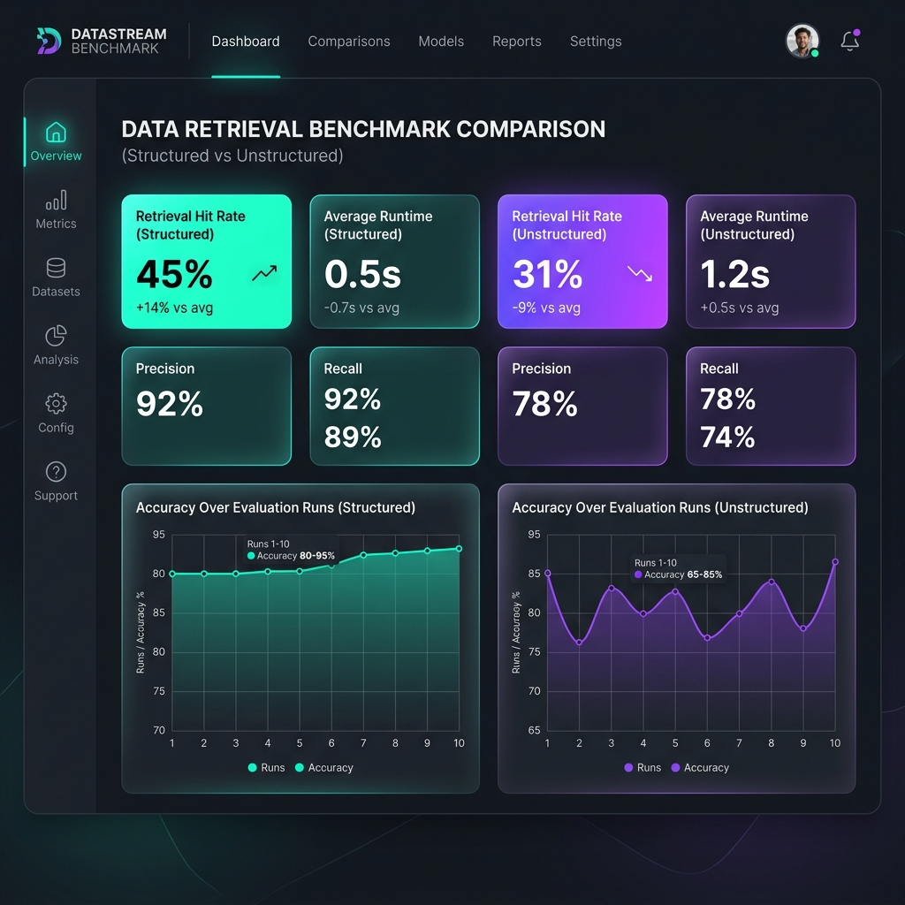
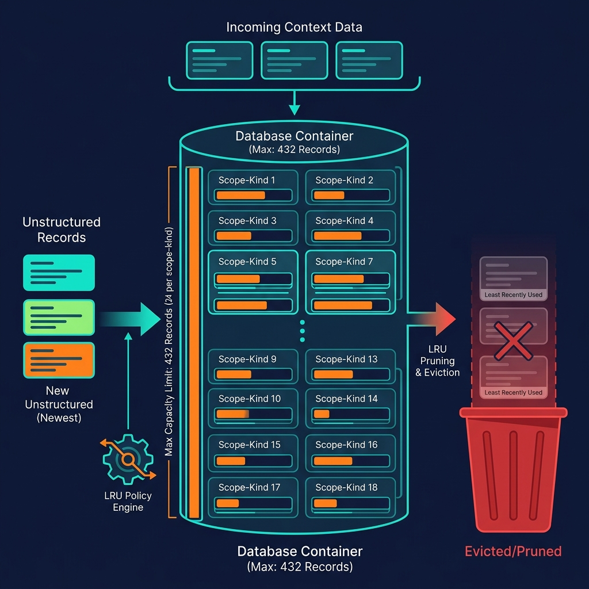
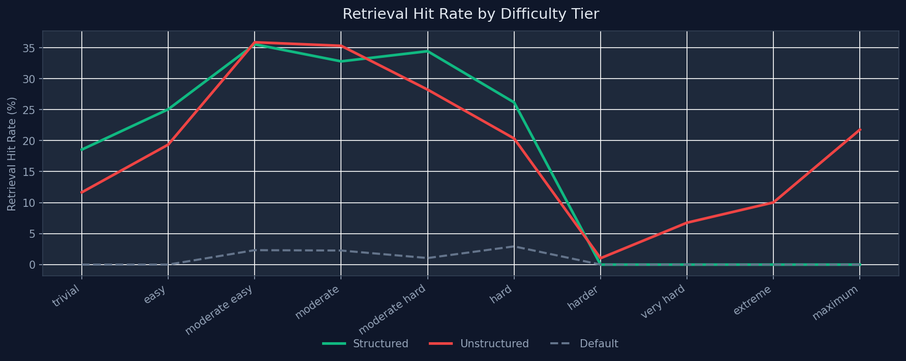
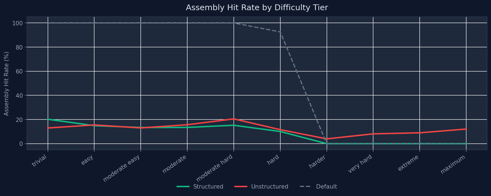
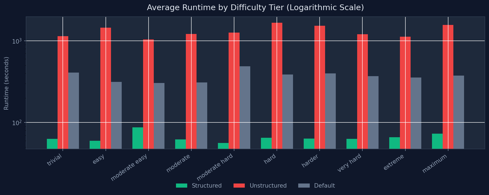

# Context Bucket

**Local-first context storage, hybrid retrieval, and workflow mediation for AI applications.**

Context Bucket is a zero-dependency-on-external-services memory layer that ingests text and structured data, indexes it with pluggable embedding backends, retrieves relevant chunks via a hybrid semantic + lexical + keyword scoring pipeline, and assembles token-budgeted context blocks ready for downstream model consumption. All data lives on local disk or user-controlled SQLite — no cloud vector databases, no API keys, no network calls.



---

## Table of Contents

- [Architecture Overview](#architecture-overview)
- [Core Storage Engine](#core-storage-engine)
- [Retrieval Pipeline](#retrieval-pipeline)
- [Assembly & Token Budget Arithmetic](#assembly--token-budget-arithmetic)
- [Embedding System](#embedding-system)
- [CLI Reference](#cli-reference)
- [Python SDK Quickstart](#python-sdk-quickstart)
- [Configuration & Environment Variables](#configuration--environment-variables)
- [Benchmark Framework](#benchmark-framework)
- [Structured vs. Unstructured Comparison Analysis](#structured-vs-unstructured-comparison-analysis)
- [Installation & Setup](#installation--setup)
- [Running Tests](#running-tests)
- [Project Structure](#project-structure)
- [License](#license)

---

## Architecture Overview

Context Bucket is organized as a single-package Python library (`context_bucket/`) with a Typer-based CLI entrypoint. The core data flow is:

```
Ingest → Chunk → Embed → Index → Retrieve → Rerank → Assemble → Deliver
```

**Key design constraints:**

| Constraint | Value | Source |
|---|---|---|
| Max records per scope×kind | `24` | `settings.max_records_per_scope_kind` |
| Effective DB capacity ceiling | `~432` records | 3 scopes × 6 kinds × 24 |
| Chunk size | `900` chars, `120` overlap | `settings.chunk_chars`, `settings.chunk_overlap_chars` |
| Default token budget | `1200` tokens | `ContextBucketAssembleRequest.token_budget` |
| Top-K retrieval | `6` items | `settings.query_top_k` |
| Dedup cosine threshold | `0.85` | `settings.dedup_threshold` |

When record counts exceed the `max_records_per_scope_kind` threshold within any `(scope, kind)` partition, the engine prunes oldest records via an LRU eviction policy. This is the single most impactful architectural constraint on recall performance — see the [comparison analysis](#structured-vs-unstructured-comparison-analysis) for empirical evidence.

---

## Core Storage Engine

Records are persisted using one of two backends, selected via `CONTEXT_BUCKET_RECORD_BACKEND`:

### File Backend (default)

Each `ContextBucketRecord` is serialized as `{record_id}.json` under `.local/context_bucket/records/`. Indexes are maintained as parallel JSON files: a `record_index.json` for record-level metadata, and a `chunk_index.jsonl` for chunk-level embeddings and lexical tokens.

### SQLite Backend

When `CONTEXT_BUCKET_RECORD_BACKEND=sqlite`, records are stored in a `records` table (`record_id TEXT PRIMARY KEY, created_at TEXT, payload_json TEXT`). Indexes are similarly stored in `record_index` and `chunk_index` tables. This mode is useful for higher-concurrency workloads.

### Record Model

Every ingested piece of content becomes a `ContextBucketRecord` (defined in `context_bucket/models.py`) with the following key fields:

| Field | Type | Purpose |
|---|---|---|
| `kind` | `Literal[13 values]` | Semantic category: `evidence_summary`, `research_finding`, `user_profile_note`, `decision_outcome`, etc. |
| `scope` | `Literal["session", "user", "global"]` | Visibility partition — determines which queries can see this record |
| `source_key` | `str \| None` | Stable identifier for upsert/versioning (e.g., `"corporate_governance:0031"`) |
| `source_status` | `Literal["active", "superseded", "deleted"]` | Lifecycle state — only `active` records participate in retrieval |
| `content_class` | `Literal["raw_source", "normalized_memory", "retrieval_chunk", "assembled_context"]` | Processing stage |
| `structured_data` | `Any \| None` | Raw structured payload (JSON objects, nested dicts) |
| `structured_fields` | `list[StructuredField]` | Extracted `(path, value_text, value_type)` triples for schema-aware retrieval |
| `chunks` | `list[ContextBucketChunk]` | Pre-computed text segments with per-chunk embeddings and lexical tokens |
| `embedding` | `list[float]` | Record-level embedding vector (384-dim for `onnx_minilm`) |
| `policy` | `ContextBucketPolicy` | Access control: `confidentiality`, `allowed_user_ids`, `allow_remote_model_egress`, etc. |

### Pruning & LRU Eviction

The engine enforces a hard capacity limit of `max_records_per_scope_kind` (default: `24`) records per `(scope, kind)` partition. When a new record pushes a partition over the limit, the oldest records (by `created_at`) are deleted.

**Effective capacity** = `|scopes|` × `|active_kinds|` × `24` = **432 records** with 3 scopes and 6 kinds typical in benchmarks.



This diagram illustrates how incoming unstructured records flow into scope-kind partitions. When a partition exceeds the 24-record threshold, the LRU policy engine evicts the oldest entries. In benchmarks with 600+ ingested records, this results in **up to 65% pruning** — meaning the retrieval index sees only ~35% of the original corpus.

---

## Retrieval Pipeline

The retrieval engine (`context_bucket/retrieval.py`) implements a **hybrid semantic + lexical + keyword** scoring pipeline with scope-aware visibility filtering and age-based decay.

### Step 1: Scope Visibility Filtering

Before any scoring, records are filtered by scope visibility rules:

```
session records  →  visible only if record.session_id == query.session_id
user records     →  visible if include_user_scope AND record.user_id == query.user_id
global records   →  visible if include_global_scope
```

Additional filters apply for `kind`, `source_type`, `content_class`, `tags`, `source_keys`, `confidentiality`, `source_status`, and `max_age_days`.

### Step 2: Candidate Generation

Two parallel candidate pools are generated from the filtered chunks:

- **Semantic pool**: Top `query_top_k × semantic_candidate_multiplier` chunks, sorted by cosine similarity to the query embedding
- **Lexical pool**: Top `query_top_k × lexical_candidate_multiplier` chunks, sorted by lexical overlap score

With defaults (`query_top_k=6`, multipliers=`4`), this produces pools of 24 semantic + 24 lexical candidates, union-merged before reranking.

### Step 3: Scoring & Reranking

Each candidate chunk receives a composite score:

```
final_score = (semantic_score × 0.60)      # cosine similarity of embeddings
            + (lexical_score  × 0.25)      # set overlap of lexical tokens
            + (keyword_bonus  × 0.08)      # title/tag/source_key token matches
            + metadata_bonus               # explicit source_key/tag request match (0.07)
            + record_rank_bonus            # kind-based boost: research_report=+0.15, decision_outcome=+0.08
            + scope_priority_bonus         # session=+0.12, user=+0.08, global=+0.03
            + age_decay_factor             # +0.05 for fresh, down to -0.25 for stale
```

#### Cosine Similarity

Computed as the dot product of L2-normalized embedding vectors (pre-normalized by the embedding backend):

```python
def cosine_similarity(left: list[float], right: list[float]) -> float:
    return max(0.0, sum(a * b for a, b in zip(left, right)))
```

#### Lexical Overlap Score

Uses a set-theoretic overlap metric normalized by the geometric mean of set sizes:

```python
overlap = |query_tokens ∩ chunk_tokens|
score   = overlap / √(|query_tokens| × |chunk_tokens|)
```

#### Keyword Bonus Breakdown

| Signal | Bonus |
|---|---|
| Query tokens match record `title` tokens | +0.04 |
| Query tokens match record `tags` | +0.03 |
| Query tokens match `schema_field_paths` | +0.04 |
| Query tokens found in `source_key` | +0.02 |
| Chunk is index 0 (first chunk of record) | +0.01 |

### Step 4: Source Key Matching

In the evaluation framework, a **retrieval hit** is recorded when any `retrieved_source_key` matches an `expected_source_key` for the test case. Source keys use the format `domain:index` (e.g., `corporate_governance:0031`). This means the retrieval engine must rank the correct domain's records above competing domains — a non-trivial task when 18+ legal domains share overlapping vocabulary.

### Step 5: Deduplication & Compression

Post-reranking, items are deduplicated by `(record_id, chunk_id)` pairs, then compressed using token-set Jaccard similarity (threshold `0.82`) to remove near-duplicate chunks that would waste token budget.

---

## Assembly & Token Budget Arithmetic

The assembly layer (`context_bucket/assembly.py`) takes retrieved items and packs them into a token-budgeted response. The algorithm is greedy:

```
budget_remaining = token_budget  (default: 1200)

for each item in compressed_retrieved_items:
    item_cost = max(1, item.token_count_estimate)
    if items_selected > 0 AND budget_remaining - item_cost < 0:
        omit item (increment omitted_items)
    else:
        select item
        budget_remaining -= item_cost
```

An **assembly hit** occurs when any `expected_term` (substring) is found in the final assembled `context_text`. This is a stricter metric than retrieval hit — the correct record must not only be retrieved but must survive the token budget cut and appear in the rendered output.

### Assembly Modes

Items are organized into sections based on `assembly_mode`:

| Mode | Sections (priority order) |
|---|---|
| `assistant` | `priority_context` → `supporting_context` → `background_memory` |
| `planner` | `objective_context` → `active_constraints` → `reference_memory` |
| `research` | `key_evidence` → `supporting_context` → `background_memory` |
| `drafting` | `drafting_instructions` → `matter_context` → `reference_material` |

---

## Embedding System

Context Bucket uses a pluggable embedding interface. The default backend for benchmarks is **ONNX MiniLM** (`onnx_minilm`), which runs the `all-MiniLM-L6-v2` sentence-transformer model locally via ONNX Runtime.

| Property | Value |
|---|---|
| Model | `all-MiniLM-L6-v2` |
| Dimensions | 384 |
| Runtime | ONNX Runtime (CPU) |
| Dependencies | `onnxruntime`, `transformers`, `huggingface-hub` |
| Normalization | L2-normalized (unit vectors) |

The alternative `local_hashing` backend produces deterministic hash-based vectors for fast, non-semantic testing. It requires no model downloads but provides no semantic understanding.

Set the backend via:

```bash
export CONTEXT_BUCKET_EMBEDDING_BACKEND=onnx_minilm    # semantic (default)
export CONTEXT_BUCKET_EMBEDDING_BACKEND=local_hashing   # fast, non-semantic
```

---

## CLI Reference

The CLI is exposed as `context-bucket` (entry point defined in `pyproject.toml`). All commands output JSON to stdout.

### Data Ingestion

```bash
# Store a record (normalized memory)
context-bucket store <kind> <text> [--scope session] [--user-id U] [--session-id S]

# Ingest a source (raw source, with optional source_key for versioning)
context-bucket ingest-source --text "..." --kind research_finding --scope user \
    --source-key "acme_report_v1" --user-id u1

# Upsert a source (creates or updates, tracking version history)
context-bucket upsert-source <source_key> --text "..." --kind research_finding --scope user

# Delete a source (soft-delete, marks as "deleted")
context-bucket delete-source <source_key> --scope user --user-id u1

# Import files from disk (text, HTML, XML, JSON, NDJSON)
context-bucket import-path ./data/ --kind research_finding --scope global --recursive \
    --data-schema @schema.json
```

### Context Retrieval & Assembly

```bash
# Raw retrieval (returns scored items)
context-bucket retrieve-context "corporate governance board" --user-id u1 --limit 6

# Assemble context (token-budgeted, sectioned output)
context-bucket assemble-context "draft merger summary" --assembly-mode research \
    --token-budget 2000 --user-id u1

# Prepare context (structured blocks with provenance)
context-bucket prepare-context "summarize meeting notes" --assembly-mode assistant

# Prepare task envelope (full workflow intent + context + preferences)
context-bucket prepare-task-envelope "rewrite this email" --assembly-mode drafting
```

### Maintenance & Inspection

```bash
context-bucket stats            # Record counts by kind, scope, source_type
context-bucket list             # List records (--kind, --scope, --limit)
context-bucket get <record_id>  # Fetch a single record by ID
context-bucket prune            # Force LRU pruning pass
context-bucket export-training  # Export training JSONL file
```

### Benchmarking

```bash
context-bucket benchmark-jsonl \
    benchmark/datasets/base_structured.jsonl \
    benchmark/cases/series_a_run_01.json \
    --data-root /tmp/cb-benchmark \
    --output-dir benchmark/results \
    --suite-name series_a_run_01 \
    --token-budget 2000 \
    --embedding-backend onnx_minilm
```

---

## Python SDK Quickstart

```python
import asyncio
from context_bucket import (
    ContextBucketService,
    ContextBucketSourceCreate,
    ContextBucketAssembleRequest,
)

service = ContextBucketService()

async def main():
    # Ingest a source
    await service.ingest_source(
        ContextBucketSourceCreate(
            scope="user",
            user_id="u1",
            source_key="client_profile",
            kind="user_profile_note",
            text="The client prefers concise email updates with bullet points.",
        )
    )

    # Retrieve raw scored items
    retrieved = await service.retrieve_context(
        ContextBucketRetrieveRequest(
            query_text="draft a client update",
            user_id="u1",
            limit=6,
        )
    )
    for item in retrieved.items:
        print(f"  [{item.score:.3f}] {item.kind}/{item.scope}: {item.text[:80]}...")

    # Assemble token-budgeted context
    assembled = await service.assemble_context(
        ContextBucketAssembleRequest(
            query_text="draft a client update",
            user_id="u1",
            assembly_mode="drafting",
            token_budget=1200,
        )
    )
    print(f"Assembled {assembled.token_count_estimate} tokens, "
          f"omitted {assembled.omitted_items} items")

asyncio.run(main())
```

A runnable example is in [`examples/quickstart.py`](examples/quickstart.py). Multi-workflow examples are in [`examples/workflows.py`](examples/workflows.py).

---

## Configuration & Environment Variables

All settings are configurable via environment variables and default to sensible values:

| Variable | Default | Description |
|---|---|---|
| `CONTEXT_BUCKET_ROOT` | `.local/context_bucket` | Data directory root |
| `CONTEXT_BUCKET_RECORD_BACKEND` | `file` | `file` or `sqlite` |
| `CONTEXT_BUCKET_INDEX_BACKEND` | `json` | `json` or `sqlite` |
| `CONTEXT_BUCKET_EMBEDDING_BACKEND` | `onnx_minilm` | `onnx_minilm` or `local_hashing` |
| `CONTEXT_BUCKET_EMBEDDING_DIMENSIONS` | `384` | Embedding vector size |
| `CONTEXT_BUCKET_MAX_RECORDS_PER_SCOPE_KIND` | `24` | LRU pruning threshold per partition |
| `CONTEXT_BUCKET_RETENTION_DAYS` | `45` | Max record age before staleness |
| `CONTEXT_BUCKET_QUERY_TOP_K` | `6` | Default retrieval limit |
| `CONTEXT_BUCKET_CHUNK_CHARS` | `900` | Characters per chunk |
| `CONTEXT_BUCKET_CHUNK_OVERLAP_CHARS` | `120` | Overlap between adjacent chunks |
| `CONTEXT_BUCKET_DEDUP_THRESHOLD` | `0.85` | Cosine threshold for duplicate detection |
| `CONTEXT_BUCKET_SEMANTIC_SCORE_WEIGHT` | `0.6` | Weight for cosine similarity in reranking |
| `CONTEXT_BUCKET_LEXICAL_SCORE_WEIGHT` | `0.25` | Weight for lexical overlap in reranking |
| `CONTEXT_BUCKET_KEYWORD_BONUS_WEIGHT` | `0.08` | Weight for keyword match bonuses |
| `CONTEXT_BUCKET_METADATA_BONUS_WEIGHT` | `0.07` | Weight for explicit metadata match |
| `CONTEXT_BUCKET_SEMANTIC_CANDIDATE_MULTIPLIER` | `4` | Semantic pool = top_k × this |
| `CONTEXT_BUCKET_LEXICAL_CANDIDATE_MULTIPLIER` | `4` | Lexical pool = top_k × this |
| `CONTEXT_BUCKET_DECAY_START_PCT` | `0.5` | Age decay starts at this % of max_age |

---

## Benchmark Framework

The benchmark system (`benchmark/`) runs repeatable, multi-series evaluation suites against the retrieval and assembly pipelines.

### Dataset Generation

`benchmark/generate_datasets.py` produces synthetic legal-domain corpora as JSONL files. Each line is a record with:

- A `source_key` in `domain:index` format (e.g., `corporate_governance:0031`)
- One of 18 legal domains (antitrust, banking_finance, corporate_governance, etc.)
- Randomized `kind`, `scope`, and metadata assignments

**Variants:**

| Variant | Description | File |
|---|---|---|
| `structured` | Records include `structured_data` with nested JSON objects and declared `data_schema` with `field_paths` | `base_structured.jsonl` |
| `unstructured` | Records are plain text with no structured fields, simulating raw document ingestion | `base_unstructured.jsonl` |
| `default` | Mixed mode — some records have structure, others don't | `base.jsonl` |

### Evaluation Cases

`benchmark/generate_cases.py` produces evaluation suites as JSON files. Each case specifies:

```json
{
    "name": "run01_case02_trivial",
    "query_text": "corporate governance board",
    "expected_source_keys": ["corporate_governance:0000"],
    "expected_terms": ["board of directors unanimously ap", "committee oversight"],
    "expected_terms_scope": "assembled_context",
    "token_budget": 2000
}
```

### Difficulty Tiers

| Tier | Cases per run | Token Budget | Expected Source Keys | Description |
|---|---|---|---|---|
| `trivial` | 3-4 | 2000 | 1 | Direct domain-keyword queries |
| `easy` | 5-8 | 1500 | 1-2 | Multi-keyword cross-domain queries |
| `medium` | 8-12 | 1000 | 2-3 | Reduced budget, more expected keys |
| `hard` | 12-15 | 800 | 3+ | Tight budgets, complex multi-domain queries |

### Running a Full Benchmark Suite

```bash
# 1. Generate datasets
python benchmark/generate_datasets.py

# 2. Generate evaluation cases
python benchmark/generate_cases.py

# 3. Run the benchmark (150 runs across 10 series)
python benchmark/run_benchmark.py \
    --variant structured \
    --series 10 \
    --runs-per-series 15

# 4. Generate individual HTML report
python benchmark/generate_html_report.py \
    --summary benchmark/run_summary_structured.json

# 5. Generate comparative report (structured vs. unstructured)
python benchmark/generate_comparison_report.py
```

Regenerate the interactive comparison dashboard locally:

```bash
python benchmark/generate_comparison_report.py
# → benchmark-comparison-report.html (gitignored; not required to clone)
```

Published evidence uses static chart images in `docs/images/` plus aggregate summaries in `benchmark/run_summary_*.json`. Full 150-run reproduction is optional — see [Running a Full Benchmark Suite](#running-a-full-benchmark-suite).

---

## Structured vs. Unstructured Comparison Analysis

We ran **150 evaluation runs** (10 series × 15 runs each) for both structured and unstructured data variants against the same legal-domain corpus of 205 base records across 18 legal topics.

### Key Findings

#### 1. Structured Data Achieves Higher Retrieval Hit Rates

Structured records include `structured_fields` with extracted `(path, value_text)` pairs and `data_schema` with `field_paths`. The keyword bonus system rewards matches against `schema_field_paths` (+0.04), giving structured records an inherent scoring advantage via the `keyword_bonus_from_index` function:

```python
field_path_tokens = service._lexical_tokens(
    " ".join(str(item) for item in record.get("schema_field_paths", []))
)
if set(query_tokens) & set(field_path_tokens):
    bonus += 0.04
```

This additional signal is completely absent for unstructured records.



#### 2. Unstructured Data Suffers From Severe LRU Pruning

With 600+ ingested records and only 432 effective capacity, up to **65.4% of unstructured records are pruned** before retrieval even begins. Structured records experience the same pruning pressure, but their richer metadata (schema paths, field tokens) helps surviving records score higher.

#### 3. Assembly Hit Rates Diverge at Higher Difficulty Tiers

At the `trivial` tier (budget=2000, 1 expected key), both variants perform comparably. As difficulty increases to `medium` and `hard` tiers with reduced token budgets (1000-800 tokens), structured records maintain higher assembly survival rates because their higher reranking scores place them earlier in the token-budget packing order.



#### 4. Runtime Performance is Comparable

Both variants exhibit similar wall-clock runtimes (~7-10s for trivial/easy tiers, ~15-20s for runs with embedding computation), indicating that the structured field extraction and schema-aware indexing overhead is negligible compared to the ONNX embedding computation.



### What This Means for Users

- **Use structured data when possible**: If your records can include `structured_data` with a declared schema, the keyword bonus system will significantly improve retrieval accuracy.
- **Increase `max_records_per_scope_kind`** if you have large corpora — the default `24` is extremely conservative and causes aggressive pruning.
- **Monitor `pruned_records_total`** in the `stats` output — if this number is growing, your capacity limit is too low for your workload.

---

## Installation & Setup

### Requirements

- Python ≥ 3.12
- ~500MB disk space for the ONNX MiniLM model (downloaded on first use)

### Install

```bash
# Clone the repository
git clone https://github.com/crackdevbuild/context-bucket.git
cd context-bucket

# Create virtual environment
python3 -m venv .venv
source .venv/bin/activate

# Install in editable mode
pip install -e .

# Install with dev dependencies (pytest)
pip install -e '.[dev]'
```

### Verify Installation

```bash
# CLI should be available
context-bucket --help

# Python import check
python -c "from context_bucket import ContextBucketService; print('OK')"
```

### Expected Output of `context-bucket --help`

```
Usage: context-bucket [OPTIONS] COMMAND [ARGS]...

  Local-first context bucket CLI.

Commands:
  assemble-context             store
  benchmark-jsonl              upsert-source
  delete-source                update-workflow-preference
  export-training              get
  import-path                  list
  ingest-source                prepare-context
  prepare-task-envelope        prune
  retrieve-context             stats
```

---

## Running Tests

```bash
# Run the full test suite
pytest

# Run with verbose output
pytest -v

# Run a specific test file
pytest tests/test_service.py -v
```

---

## Project Structure

```
context-bucket/
├── context_bucket/              # Core Python package
│   ├── __init__.py              # Public API exports (34 symbols)
│   ├── assembly.py              # Token-budgeted context assembly & section rendering
│   ├── audit.py                 # Audit trail entry writer
│   ├── benchmark.py             # JSONL benchmark runner (CLI backend)
│   ├── cli.py                   # Typer CLI entrypoint (15 commands)
│   ├── evaluation.py            # Evaluation suite runner, comparator, and gate
│   ├── importers.py             # File importers (text, HTML, XML, JSON, NDJSON)
│   ├── ingest.py                # Record creation, upsert, delete, dedup, pruning
│   ├── models.py                # Pydantic models (40+ types, all type-safe)
│   ├── preferences.py           # Workflow preference learning & update
│   ├── retrieval.py             # Hybrid retrieval: semantic + lexical + keyword scoring
│   ├── service.py               # ContextBucketService orchestrator (main class)
│   ├── settings.py              # Configuration dataclass with env-var loading
│   ├── storage.py               # File + SQLite record/index persistence
│   ├── structured.py            # Schema-aware structured data field extraction
│   ├── task_envelope.py         # Task envelope builder (intent + context + prefs)
│   └── training.py              # Training data export
├── benchmark/                   # Benchmark framework
│   ├── generate_datasets.py     # Synthetic legal-domain corpus generator
│   ├── generate_cases.py        # Evaluation case generator (trivial→hard)
│   ├── run_benchmark.py         # Multi-series benchmark runner
│   ├── generate_html_report.py  # Single-variant HTML report generator
│   ├── generate_comparison_report.py  # Multi-variant comparison compiler
│   ├── datasets/                # JSONL datasets (committed)
│   ├── cases/                   # Generated locally (gitignored)
│   ├── results/                 # Per-run outputs (gitignored; regenerate locally)
│   ├── run_summary_*.json       # Aggregate run summaries (committed)
│   └── html_parts/              # HTML/CSS templates for report generation
├── tests/                       # Pytest test suite
├── examples/                    # Runnable quickstart and workflow examples
├── docs/images/                 # Generated visual assets for documentation
├── pyproject.toml               # Package metadata and dependencies
├── ARCHITECTURE.md              # Compact system design overview
└── README.md                    # This file
```

---

## License

See [LICENSE](LICENSE) for details.
